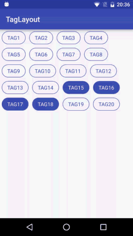
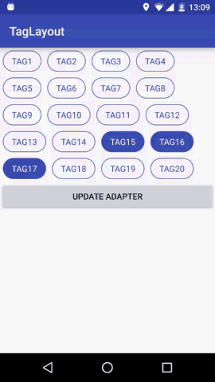

TagLayout
=========

#Preview





#build.gradle

In your project root path build.gradle file, add this:

```groovy
allprojects {
    repositories {
        ...
        maven { url "https://jitpack.io" }
    }
}
```

And in your module path build.gradle file, add this:

```groovy
dependencies {
    compile 'com.github.onlynight:TagLayout:1.0.1'
}
```

#Sample Code

xml layout file:

```xml
<com.github.onlynight.taglayout.library.TagLayout
    android:id="@+id/tagLayout"
    android:layout_width="match_parent"
    android:layout_height="wrap_content"
    app:maxSelectCount="none"/>
```

java controller file:

```java
private TagLayout tagLayout;
private TagAdapter adapter;

@Override
protected void onCreate(Bundle savedInstanceState) {
    super.onCreate(savedInstanceState);
    setContentView(R.layout.activity_main);

    tagLayout = (TagLayout) findViewById(R.id.tagLayout);
    initAdapter();
    setSelectMode();
    setSelect();
    setListener();
}

private void initAdapter() {
    List<Tag> data = new ArrayList<>();
    for (int i = 0; i < 20; i++) {
        data.add(new Tag(getResources().getString(R.string.tag) + (i + 1)));
    }
    adapter = new TagAdapter(this);
    adapter.addTags(data);
    tagLayout.setAdapter(adapter);
}

private void setSelectMode() {
    tagLayout.setSelectMode(TagLayout.SELECT_MODE_SINGLE);
    // this method is the same as setSelectMode();
    // tagLayout.setMaxSelectCount(1);
}

private void setSelect() {
    List<Integer> selected = new LinkedList<>();
    for (int i = 0; i < 6; i++) {
        selected.add(14 + i);
    }
    tagLayout.setSelect(selected);
}

private void setListener() {
    tagLayout.setOnTagItemSelectedListener(new TagLayout.OnTagItemSelectedListener() {
        @Override
        public void onSelected(boolean selected, int currentSelected, List<Integer> allSelected) {
            String showStr = "";
            if (selected) {
                showStr = "select item " + currentSelected;
            } else {
                showStr = "cancel select item " + currentSelected;
            }
            Toast.makeText(MainActivity.this, showStr, Toast.LENGTH_SHORT).show();
        }

        @Override
        public void onCanNotSelectMore(boolean selected, int currentSelected, List<Integer> allSelected) {
            Toast.makeText(MainActivity.this,
                    "the MAX select item is " + tagLayout.getMaxSelectCount(),
                    Toast.LENGTH_SHORT).show();
        }
    });
}
```

You need a adapter extends BaseAdapter just like ListView’s Adapter.

#XML property explain

```xml
<declare-styleable name="TagLayout">

    <!-- set the max select count;
    the default value is 1, it means you can select one item at the same time.-->
    <attr name="maxSelectCount" format="integer|enum">
        <enum name="all" value="-1"/>
        <enum name="single" value="1"/>
        <enum name="none" value="0"/>
    </attr>

    <!-- is the all item in one line, the default value is false -->
    <attr name="singleLine" format="boolean"/>

    <!-- set the max item in one line the default is -1,
    that means view will auto calculate the child in one line.-->
    <attr name="maxItemsInOneLine" format="integer"/>

    <!-- if the item has equal width, the default is false.
    this property only when you set maxItemsInOneLine property,
    then this will effect-->
    <attr name="isItemsEqualWidth" format="boolean"/>
</declare-styleable>
```

#API explain

```java
/**
 * To set this listener you can listen item select action and
 * listen there're no more tag can be selected
 *
 * @param onTagItemSelectedListener
 */
public void setOnTagItemSelectedListener(OnTagItemSelectedListener onTagItemSelectedListener);

/**
 * get the max select count
 *
 * @return
 */
public int getMaxSelectCount();

/**
 * set the base adapter
 *
 * @param adapter
 */
public void setAdapter(BaseAdapter adapter);

/**
 * clear all the selected item.
 */
public void clearSelect();

/**
 * get selected item id.
 *
 * @return a list of selected item's id.
 */
public List<Integer> getSelected();

/**
 * set item state to selected.
 *
 * @param items the items you want to be set select.
 */
public void setSelect(List<Integer> items);

/**
 * set the select mode.
 *
 * @param selectModeOrMaxSelectCount {@link TagLayout.SELECT_MODE_ALL} can select all.</p>
 *                                   {@link TagLayout.SELECT_MODE_NONE} can select none.</p>
 *                                   {@link TagLayout.SELECT_MODE_SINGLE} can select one.</p>
 *                                   or you can set the max select count you want.</p>
 */
public void setSelectMode(int selectModeOrMaxSelectCount);

/**
 * set the tag layout max select count.</p>
 * this method is the same as {@link TagLayout#setSelectMode(int)}
 *
 * @param maxSelectCount it is bigger than 0,</p>
 *                       the -1 is means you can select all tag item.</p>
 *                       {@link TagLayout.SELECT_MODE_ALL} can select all.</p>
 *                       {@link TagLayout.SELECT_MODE_NONE} can select none.</p>
 *                       {@link TagLayout.SELECT_MODE_SINGLE} can select one.</p>
 */
public void setMaxSelectCount(int maxSelectCount);
```

#License

```
Copyright 2016 onlynight

Licensed under the Apache License, Version 2.0 (the "License");
you may not use this file except in compliance with the License.
You may obtain a copy of the License at

   http://www.apache.org/licenses/LICENSE-2.0

Unless required by applicable law or agreed to in writing, software
distributed under the License is distributed on an "AS IS" BASIS,
WITHOUT WARRANTIES OR CONDITIONS OF ANY KIND, either express or implied.
See the License for the specific language governing permissions and
limitations under the License.
```
